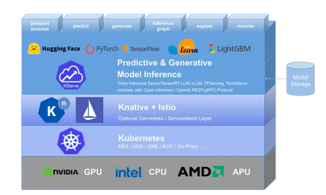
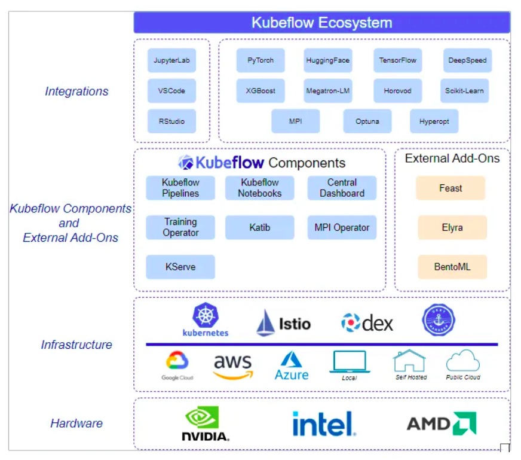

# ai-infrastructure-kubeflow

Este guia detalha a configuração de um ambiente Kubeflow com suporte a GPU para machine learning e serving de modelos, utilizando Minikube em um PC com Ubuntu. O processo inclui a instalação do Docker, configuração do NVIDIA Container Toolkit para permitir o acesso à GPU, e a inicialização do Minikube com o driver Docker e suporte a GPU. Em seguida, é realizada a instalação do Kubeflow, com ajustes para garantir a estabilidade da versão, e a verificação do dashboard para confirmar o funcionamento dos componentes.

Para validar o acesso à GPU, é criado um servidor Jupyter Notebook via dashboard do Kubeflow, utilizando uma imagem customizada compatível com a versão do CUDA disponível (no caso, v1.7.0). Por fim, é executado um teste em Python com TensorFlow para confirmar o reconhecimento da GPU e realizar uma operação de multiplicação de tensores, comprovando que o ambiente está pronto para o desenvolvimento e execução de pipelines de ML com aceleração gráfica.



## Configurando Minikube com Suporte a GPU NVIDIA (Driver Docker)

Este guia irá ajudá-lo a configurar o Minikube para usar sua GPU NVIDIA com o driver Docker.

### Pré-requisitos

1.  **Driver NVIDIA**: Você deve ter um driver NVIDIA instalado em sua máquina.
    *   **Verificar Instalação**: Execute `nvidia-smi`. Se ele mostrar informações da GPU e do driver, você está pronto.
    *   **Instalar Driver**: Caso contrário, siga o [Guia de Instalação de Drivers NVIDIA](https://www.nvidia.com/Download/index.aspx).

2.  **Configurar `bpf_jit_harden`**:
    *   Verifique o valor atual:
      ```bash
      sudo sysctl net.core.bpf_jit_harden
      ```
    *   Se o resultado não for `0`, execute:
      ```bash
      echo "net.core.bpf_jit_harden=0" | sudo tee -a /etc/sysctl.conf
      sudo sysctl -p
      ```

### Instalação e Configuração

Escolha um dos métodos abaixo para ativar o suporte à NVIDIA no Docker.

#### Método A: NVIDIA Container Toolkit (Recomendado)

1.  **Instale o NVIDIA Container Toolkit** em sua máquina. Siga o [guia de instalação oficial](https://docs.nvidia.com/datacenter/cloud-native/container-toolkit/latest/install-guide.html).

2.  **Configure o Docker** para usar o runtime da NVIDIA:
    ```bash
    sudo nvidia-ctk runtime configure --runtime=docker
    sudo systemctl restart docker
    ```

#### Método B: Recursos NVIDIA CDI

Habilite os recursos da NVIDIA CDI (Container Device Interface) em sua máquina. Consulte a [documentação da NVIDIA CDI](https://docs.nvidia.com/datacenter/cloud-native/cdi/index.html) para instruções de configuração.

### Iniciando o Minikube

1.  **Deletar Cluster Existente (Recomendado)**:
    Se você já tem um cluster Minikube, delete-o para garantir que ele utilize a nova configuração NVIDIA.
    ```bash
    minikube delete
    ```

2.  **Inicie o Minikube** usando o método que você configurou acima.

    *   **Se você usou o Método A (NVIDIA Container Toolkit)**:
      ```bash
      minikube start --driver=docker --container-runtime=docker --gpus=all
      ```

    *   **Se você usou o Método B (NVIDIA CDI)**:
      ```bash
      minikube start --driver=docker --container-runtime=docker --gpus=nvidia.com
      ```

## Instalando o kubeflow

O Kubeflow é uma plataforma open-source completa para Machine Learning e MLOps, projetada para executar fluxos de trabalho de ML de forma escalável e portável em clusters Kubernetes. Ele oferece componentes como Jupyter Notebooks, Pipelines (orquestração de workflows), Katib (otimização de hiperparâmetros), KServe (serving de modelos) e armazenamento de metadados, facilitando todo o ciclo de vida do machine learning — desde o desenvolvimento e treinamento até o deployment e monitoramento de modelos em produção.



### **Instalação do Kubeflow no Minikube**

**Instalar kustomize:**
   ```bash
    # Download da versão mais recente
    wget https://github.com/kubernetes-sigs/kustomize/releases/download/kustomize%2Fv5.3.0/kustomize_v5.3.0_linux_amd64.tar.gz

    # Extrair o arquivo
    tar -xzf kustomize_v5.3.0_linux_amd64.tar.gz

    # Mover para o PATH do sistema
    sudo mv kustomize /usr/local/bin/

    # Verificar a instalação
    kustomize version
   ```

**Clonar repositório do Kubeflow:**
   ```bash
   git clone https://github.com/kubeflow/manifests.git
   cd manifests
   ```

**Aplicar os manifests com Kustomize:**
   ```bash
   while ! kustomize build example | kubectl apply -f -; do echo "Retrying..."; sleep 10; done
   ```
Obs: Alguns componentes irao dar erro inicialmente, é necessario deixar o comando rodar e ciclar nas tentativas por algumas vezes.


7. **Verificar os pods (aguardar todos estarem Running):**
   ```bash
   kubectl get pods -A
   ```

8. **Acessar o Dashboard do Kubeflow:**
   ```bash
   kubectl port-forward --address 0.0.0.0 svc/istio-ingressgateway -n istio-system 8080:80
   ```
   - Acesse: `http://localhost:8080`
   - Login: `user@example.com`
   - Senha: `12341234`

## Referencias

https://minikube.sigs.k8s.io/docs/tutorials/nvidia/

https://medium.com/@prayag-sangode/installing-kubeflow-60dfb9d620fb

https://medium.com/@bkasap/setting-up-a-gpu-optimized-kubeflow-environment-for-machine-learning-and-model-serving-582e95b56199
